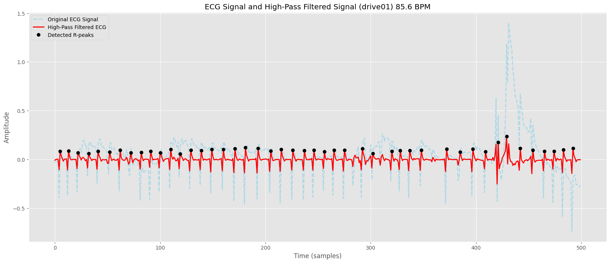
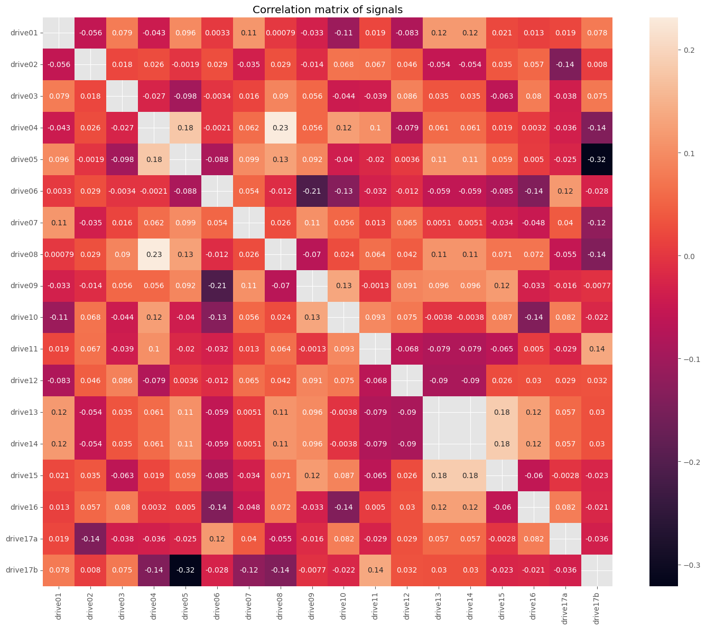
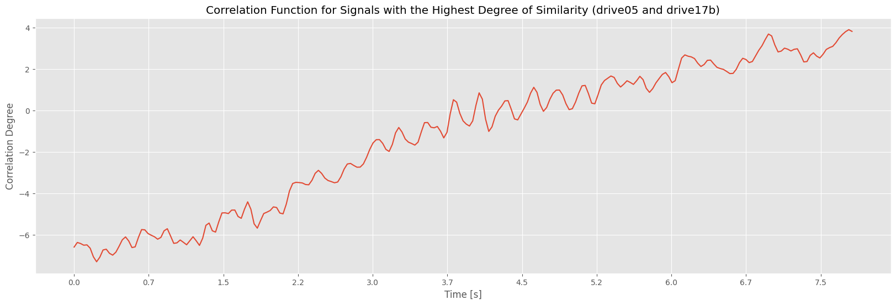
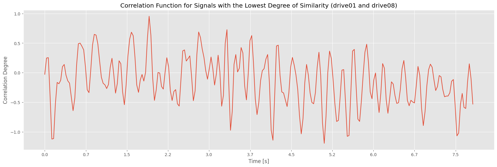
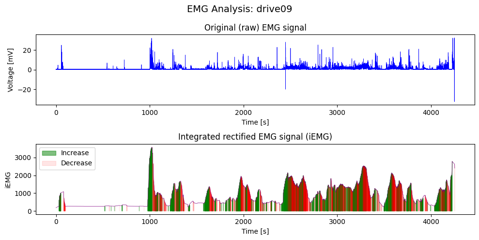
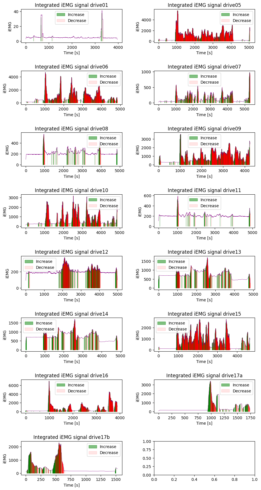

# I. seminární práce z předmětu Počítačové zpracování signálu (KI/PZS)

- Tým: Martin Formánek, Radek Šmejkal
- 28.01.2025
- [Úloha 1](sem1.ipynb)
- [Úloha 2](sem2.ipynb)
- [Úloha 3](sem3.ipynb)
- [Zadání](SeminarniPrace-I.pdf)

## Zádání: Výpočet tepové frekvence z EKG signálu

Ve zdrojové databázi najdete celkem 17 měření EKG signálu. Signál je již filtrován a centralizován kolem podélné osy. EKG signál obsahuje dominantní peaky, které se nazývají R vrcholy. Vzdálenost těchto vrcholů určuje dobu mezi jednotlivými tepy. Počet tepů za minutu je tedy počet R vrcholů v signálu o délce jedné minuty. Navrhněte algoritmus, který bude automaticky detekovat počet R vrcholů v EKG signálech a prezentujte tepovou frekvenci při jednotlivých jízdách/měřeních. Vás algoritmus následně otestujte na databázi MIT-BIH <https://physionet.org/content/nsrdb/1.0.0/> a prezentujte jeho úspěšnost vzhledem k anotovaným datům z databáze.

### Řešení

Nejprve jsem signál filtroval pomocí high-pass filtru `high_pass_filter(sig, sinfo["fs"])`, aby se eliminovaly šumy a nízkofrekvenční složky signálu, které by mohly rušit detekci R-peaků.  
Následně jsem odhadl hranici pro detekci R-peaků na základě N-tého percentilu hodnot signálu `np.percentile(signal, p_threshold)`, čímž jsem stanovil dynamický práh, který se přizpůsobí různým amplitudám signálu.  
Poté jsem identifikoval všechny potenciální R-peaky, tak že jsem aplikoval hraniční masku na celý signál. Ta vrátila všechny části signálu, které jsou nad maskou a v každé části se našel právě jeden R-Peak, což zabraňuje detekci falešných pozitivních peaků v oblasti signálu, která je stále nad prahovou hodnotou.

```py
above_threshold = signal > threshold
...
for start, end in zip(rise, fall):
    segment = signal[start:end]
    if len(segment) == 0:
        continue
    max_idx = np.argmax(segment)
    peak_idx = start + max_idx
    peaks.append(peak_idx)
    peaks_values.append(signal[peak_idx])
```

Dále jsem implementoval filtraci detekovaných R-peaků na základě minimální vzdálenosti mezi jednotlivými peakami a minimální výšky, což pomáhá odstranit menší a méně výrazné peakové hodnoty, zejména v signálech s vysokou frekvencí oscilací.

```py
if min_distance > 0:
        ...
        for peak in sorted_peaks:
            if used[peak]:
                continue
            start = max(0, peak - min_distance)
            end = min(len(signal), peak + min_distance + 1)
            if not used[start:end].any():
                filtered_peaks.append(peak)
                used[start:end] = True
        ...

    if min_peak_height is not None:
        peaks = [peak for peak in peaks if signal[peak] >= min_peak_height]
        peaks_values = [signal[peak] for peak in peaks]
```

### Grafický výstup



### Test

Výsledky testů algoritmu nad databází [MIT-BIG](https://physionet.org/content/nsrdb/1.0.0/). Výstup ukazuje správně označené R-Peaky (TP), špatně označené R-Peaky (FP), a neoznačené R-Peaky (FN).

```File: 16265 | TP: 100963, FP: 3300, FN: 414 | Precision: 0.97, Recall: 1.00, F1-Score: 0.98
File: 16272 | TP: 98492, FP: 14122, FN: 4312 | Precision: 0.87, Recall: 0.96, F1-Score: 0.91
File: 16273 | TP: 90544, FP: 8578, FN: 162 | Precision: 0.91, Recall: 1.00, F1-Score: 0.95
File: 16420 | TP: 102980, FP: 2405, FN: 282 | Precision: 0.98, Recall: 1.00, F1-Score: 0.99
File: 16483 | TP: 108187, FP: 17013, FN: 109 | Precision: 0.86, Recall: 1.00, F1-Score: 0.93
File: 16539 | TP: 109565, FP: 7138, FN: 298 | Precision: 0.94, Recall: 1.00, F1-Score: 0.97
File: 16773 | TP: 109054, FP: 16894, FN: 4926 | Precision: 0.87, Recall: 0.96, F1-Score: 0.91
File: 16786 | TP: 101776, FP: 9113, FN: 76 | Precision: 0.92, Recall: 1.00, F1-Score: 0.96
File: 16795 | TP: 114147, FP: 4320, FN: 692 | Precision: 0.96, Recall: 0.99, F1-Score: 0.98
File: 17052 | TP: 88156, FP: 2520, FN: 372 | Precision: 0.97, Recall: 1.00, F1-Score: 0.98
File: 17453 | TP: 103183, FP: 7427, FN: 367 | Precision: 0.93, Recall: 1.00, F1-Score: 0.96
File: 18177 | TP: 116967, FP: 2275, FN: 496 | Precision: 0.98, Recall: 1.00, F1-Score: 0.99
File: 18184 | TP: 105467, FP: 20897, FN: 142 | Precision: 0.83, Recall: 1.00, F1-Score: 0.91
File: 19088 | TP: 99815, FP: 390, FN: 18180 | Precision: 1.00, Recall: 0.85, F1-Score: 0.91
File: 19090 | TP: 81800, FP: 785, FN: 326 | Precision: 0.99, Recall: 1.00, F1-Score: 0.99
File: 19093 | TP: 84064, FP: 9474, FN: 6027 | Precision: 0.90, Recall: 0.93, F1-Score: 0.92
File: 19140 | TP: 96854, FP: 887, FN: 190 | Precision: 0.99, Recall: 1.00, F1-Score: 0.99
File: 19830 | TP: 110894, FP: 1067, FN: 806 | Precision: 0.99, Recall: 0.99, F1-Score: 0.99

Average Metrics: Precision: 0.94, Recall: 0.98, F1-Score: 0.96
```

### Závěr

Z velké části závisí úspěšnost algoritmu na zvoleném percentilu hranice, kterou jsem po testováni odhadl `94`, která na ukázala nejlepší výsledky. Tuto hodnotu ovšem nelze brát jako tu nejlepší hodnotu pro všechny a všechny druhy signálů.

Algoritmus dosáhl v signálech nejvyšší přesnosti `99%` a nejnižší přesností `91%`, v průměru měl ovšem `96%` přenost (je nutné podotknout že za "přesnost" se považuje F1 skóre, které ukazuje rovnováhu mezi přesností a citlivostí).

## Zadání: Výpočet korelace EKG signálů

Ve zdrojové databázi najdete celkem 17 měření obsahující EKG signál. Signály jsou již filtrované a centralizované kolem podélné osy. Různá měření jsou získána s různou vzorkovací frekvencí. U všech signálů analyzujte vzorkovací frekvenci a proveďte sjednocení na tu dominantní z nich. Pro tyto převzorkované signály proveďte korelační analýzu a prezentujte, jak jsou si signály napříč měřeními podobné. Pro smysluplné provedení této analýzy je potřeba nejprve srovnat signály na stejný počátek, např. dle pozice prvního dominantního R peaku. Protože se délky jednotlivých signálů neshodují, je také nutné zvolit vhodnou délku korelační funkce, a to například analýzou autokorelačních funkcí samostatných signálů.

### Řešení

Signál jsem nejprve převedl na dominantní frekvenci ze všech signálů.

```py
def resample_signal(signal, original_fs, target_fs):
    num_samples = int(len(signal) * target_fs / original_fs)
    resampled_signal = sp_signal.resample(signal, num_samples)
    return resampled_signal
```

Dále jsem odstranil počáteční části signálů až po první nalezený R-peak.

```py
def trim_to_peak(signals, p_threshold=95, min_distance=3, min_peak_height=0.01):
    processed_signals = []

    for signal in signals:
        rpeaks, _ = detect_peaks(...)
        first_rpeak = rpeaks[0]
        trimmed_signal = signal[first_rpeak:]
        processed_signals.append(trimmed_signal)

    return processed_signals
```

Korelační koeficient je pak vypočítaný pomocí funkce numpy `np.corrcoef(signals)`. Tato funkce vrací korelační matici, kterou jsem zobrazil v heatmapě `seaborn.heatmap(cor_matrix, annot=True)` a jako poslední jsem ukázal maximální a minimální korelační funkce.`scipy.signal.correlate(s1, s2, mode="same")`.

### Grafický výstup

```text
Highest value in correlation matrix: 0.32099932533835346
Corresponding labels: ('drive05', 'drive17b')

Lowest value in correlation matrix: 0.0007880184681116559
Corresponding labels: ('drive01', 'drive08')
```






### Závěr

Z korelační matice jde dobře vidět že signály `drive13` a `drive14` jsou prakticky stejné a jinak největší korelace je mezi signály `drive05` a `drive17b`, zatímco nejmenší korelace je mezi signály `drive01` a `drive08`.

## Zadání - Výpočet korelace EKG signálů

Ve zdrojové databázi najdete celkem 17 měření EMG signálu. Signál je již filtrován a centralizován kolem podélné osy. EMG signály zachycují aktivitu svalů během jízdy. Pro všech 17 měření spočítejte integrované EMG (iEMG) pomocí vzorce:

$\displaystyle \text{iEMG} = \int_{0}^{t} |f(t)| , d t$

Kde, _t_ je doba záznamu, _f(t)_ je EMG signál a _| |_ symbolizuje absolutní hodnotu. Dále detekujte oblasti, kde u jednotlivých signálů dochází k nárůstu a poklesu aktivity, a to pomocí okénkové varianty iEMG a derivace funkce. Velikost okénka zvolte tak, aby byly výsledky statisticky spolehlivé.

### Řešení

Nejdříve rektifikuju každý signál pomocí `np.abs(signal)`. Následně aplikuji okénkovou metodu `np.convolve(rectified_signal, np.ones(int(sinfo["fs"])*50), mode="same")` s velikostí okna založenou na vzorkovací frekvenci. Tímto získám integoravné hodnoty EMG, kterých zjištuji derivaci `np.diff(integrated_signal)`, abych mohl určit jestli signál v daném bodě stoupá, nebo klesá.

### Grafický výstup




Hodnoty pro iEMG signálu jsou potom získány jako `np.sum(rectified_signal)) / (time[-1] / sinfo["fs"]`. Je nutné podotknout, že některé záznamy v databázi (například `drive02`, `drive03` a `drive04`) nemají zaznamenaný EMG signál. V takovém případě jsem je vynechal.

```text
iEMG record drive01: 1.81 mV·s
iEMG record drive05: 300.14 mV·s
iEMG record drive06: 262.11 mV·s
iEMG record drive07: 44.75 mV·s
iEMG record drive08: 69.87 mV·s
iEMG record drive09: 279.33 mV·s
iEMG record drive10: 215.59 mV·s
iEMG record drive11: 67.69 mV·s
iEMG record drive12: 66.98 mV·s
iEMG record drive13: 240.79 mV·s
iEMG record drive14: 240.79 mV·s
iEMG record drive15: 228.28 mV·s
iEMG record drive16: 226.82 mV·s
iEMG record drive17a: 124.01 mV·s
iEMG record drive17b: 131.53 mV·s
```

### Závěr

Myslím si, že provedená analýza poskytuje užitečné informace o dynamice svalové aktivity během jízdy a umožňuje identifikaci specifických oblastí změn aktivity, tzn. kdy se při jízdě mohla stát nějaká nečekaná událost. Přesnost algoritmu závisí na zvolené prahové hodnotě, zde jsem použil hodnotu `1.5` a velikosti okna, zde jsem použil 50-násobek vzorkovací frekvence signálu `np.ones(int(sinfo["fs"])*50`.

## Použité zdroje

- <https://numpy.org/doc/>
- <https://docs.scipy.org/doc/scipy/>
- <https://matplotlib.org/3.5.3/api/_as_gen/matplotlib.pyplot.html>
- <https://wfdb.readthedocs.io/en/latest/>
- <https://seaborn.pydata.org/>
