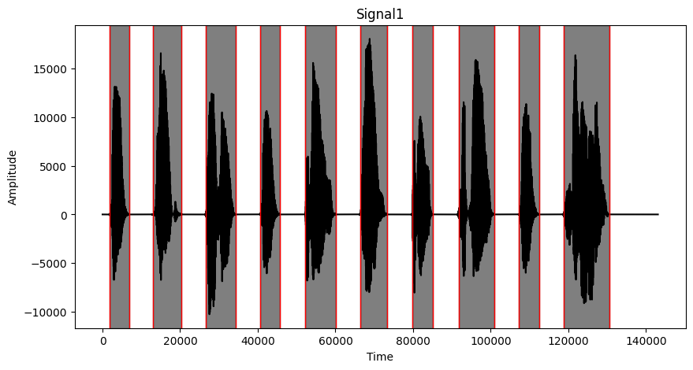

# II. seminární práce z předmětu Počítačové zpracování signálu (KI/PZS)

- Tým: Martin Formánek, Radek Šmejkal
- 28.01.2025
- [Úloha 1](sem.ipynb)
- [Zadání](SeminarniPrace-II.pdf)

## Zadání - Detekce a přiřazení slov v záznamu řeči

Ve zdrojovém souboru _Signal1.txt_ a na Obrázku 1 najdete záznam řeči převedený na signál,
resp. časovou řadu. Pomocí metod analýzy signálu v časové oblasti, frekvenční oblasti nebo
jejich kombinací identifikujte jednotlivá slova v záznamu. Vybírejte z následujícího seznamu
slov:

```text
time, prepare, solution, make, mistake, no, the, probable, long, lecture, method, disaster, fail,
work, advice, idea, succeed, easy, is, for, give
```

Vámi navržený algoritmus vyzkoušejte na záznamech _Signal2.txt_ a _Signal3.txt_ a identifikujte
slova i v těchto dvou časových řadách. V případě potřeby algoritmus dále vylepšete. Kromě
metod probraných při hodinách lze pro identifikaci jednotlivých slov využít například některé
další funkce, například Hammingova funkce nebo Hilbertova transformace, případně jakoukoli
další metodu, kterou uznáte za vhodnou, vyjma metod založených na strojovém učení.

Vzorkovací frekvence signálu je ve všech případech 22050 Hz.

### Řešení

Jako první jsem si vygeneroval `.wav` soubory jednotlivých slov a poté jsem si je uložil jako signál `scipy.io.wavfile.read(signal_file)`.  
Nejprve ze signálu odstraním prázdné části `trim_speech(audio_data[current_pos : (idx + 1) * segment_size])` a následně ho rozdělím na jednotlivá slova `segment_audio(data, segment_size, amplitude_threshold)`. Následně z každého segmentu extrahuji jeho audio charakteristiky:

```py
sY = librosa.feature.melspectrogram(y=y, sr=sr, n_fft=n_fft)
mfccsY = librosa.feature.mfcc(S=librosa.power_to_db(sY), n_mfcc=n_mfcc)
scY = librosa.feature.spectral_centroid(y=y, sr=sr, n_fft=n_fft)
chromaY = librosa.feature.chroma_stft(y=y, sr=sr, n_fft=n_fft)
```

Nakonec porovnám tyto charakteristiky pomocí directed Hauserdorff distance.

```py
dist_mfcc = directed_hausdorff(features_ref[0], features_seg[0])[0]
dist_sc = directed_hausdorff(features_ref[1], features_seg[1])[0]
dist_chroma = directed_hausdorff(features_ref[2], features_seg[2])[0]
```

Na základě těchto výsledků sestavuji seznam potenciálních slov v databázi a ze seznamu vyberu slovo s největší shodou `best_match = sorted(word_scores, key=lambda item: item[1])[0][0]`.

### Výstup pro Signal1.txt



```text
Odhadnutá věta pro Signal1.txt:
the make method the time make for prepare the solution

the - [(the - 8.41%) (for - 7.39%) (give - 6.84%) (make - 6.83%)]
make - [(make - 9.23%) (give - 8.31%) (work - 7.03%) (method - 6.64%)]
method - [(method - 8.04%) (lecture - 7.82%) (long - 7.36%) (fail - 7.18%)]
the - [(the - 8.48%) (for - 7.41%) (make - 7.08%) (no - 6.87%)]
time - [(time - 10.74%) (for - 8.99%) (fail - 8.23%) (probable - 7.46%)]
make - [(make - 7.74%) (method - 7.72%) (for - 7.69%) (long - 7.43%)]
for - [(for - 8.31%) (time - 7.43%) (give - 6.86%) (probable - 6.62%)]
prepare - [(prepare - 10.44%) (idea - 9.70%) (for - 8.72%) (lecture - 7.97%)]
the - [(the - 8.12%) (no - 7.87%) (make - 7.40%) (give - 7.21%)]
solution - [(solution - 13.08%) (for - 10.23%) (probable - 9.30%) (succeed - 9.13%)]
```

### Výstup pro Signal2.txt


```text
Odhadnutá věta pro Signal2.txt:
the give give for for

the - [(the - 9.74%) (make - 7.32%) (no - 7.13%) (give - 6.78%)]
give - [(give - 8.26%) (make - 8.13%) (for - 7.79%) (method - 6.98%)]
give - [(give - 8.73%) (make - 8.65%) (no - 7.46%) (easy - 7.11%)]
for - [(for - 7.90%) (the - 7.25%) (time - 6.72%) (give - 6.64%)]
for - [(for - 10.53%) (give - 7.00%) (time - 6.89%) (the - 6.48%)]
```

### Výstup pro Signal3.txt


```text
Odhadnutá věta pro Signal3.txt:
the for for lecture lecture

the - [(the - 8.04%) (for - 7.44%) (make - 7.20%) (no - 7.15%)]
for - [(for - 8.82%) (time - 7.18%) (give - 6.57%) (the - 6.46%)]
for - [(for - 7.83%) (give - 7.21%) (the - 6.73%) (make - 6.64%)]
lecture - [(lecture - 8.13%) (is - 7.12%) (the - 6.89%) (make - 6.64%)]
lecture - [(lecture - 10.03%) (idea - 8.80%) (succeed - 7.57%) (method - 7.27%)]
```

### Závěr

Tento přístup poskytuje efektivní metodu pro analýzu a detekci slov v signálech, přičemž určitě může být dále vylepšen. Já bych ovšem volil například strojové učení pro další zpracování podobných dat.

### Použité zdroje

- <https://numpy.org/doc/>
- <https://librosa.org/doc/latest/index.html>
- <https://matplotlib.org/3.5.3/api/_as_gen/matplotlib.pyplot.html>
- <https://pyttsx3.readthedocs.io/en/latest/>
